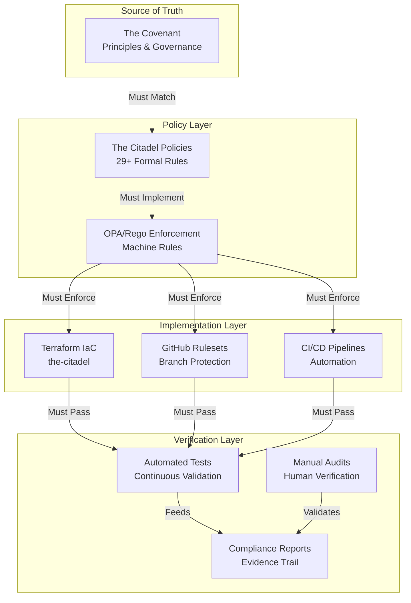

# The Citadel Audit Framework

*Systematic verification that The Covenant principles are enforced through policy and code*

## Critical Mission Statement

**This is not bureaucracy. This is the shield wall.**

Every audit task below represents a potential breach in our defenses. A single unenforced principle is a door left open to chaos. This framework ensures that what we believe (The Covenant) becomes what we enforce (The Citadel) through systematic, repeatable verification.

## Master Audit Architecture



## Phase 1: Covenant-to-Policy Traceability Audit

### Agent Instructions
**Mission:** Verify every Covenant principle has corresponding policy enforcement.

**Execution Steps:**

1. **Extract all principles from `the-covenant/PRINCIPLES.md`**
   ```bash
   grep "^### Principle [0-9]" ../the-covenant/PRINCIPLES.md
   ```

2. **Create traceability matrix:**
   | Principle | Policy ID | OPA Rule | Terraform Resource | Status |
   |-----------|-----------|----------|-------------------|---------|
   | 1: Sacred Timeline | SC-001 | source_control/linear_history.rego | github_repository_ruleset.sacred_timeline | ✅/❌ |
   | 2: Commit Purpose | SC-002 | source_control/conventional_commits.rego | github_repository_ruleset.conventional_commits | ✅/❌ |
   | ... | ... | ... | ... | ... |

3. **Verify each policy includes:**
   - [ ] Source principle reference in "Related Documents"
   - [ ] Correct policy ID format (CATEGORY-###)
   - [ ] Implementation section with code examples
   - [ ] Compliance verification procedures
   - [ ] Violation response procedures

4. **Gap Analysis:**
   ```bash
   # Find principles without policies
   for principle in $(grep "Principle [0-9]" ../the-covenant/PRINCIPLES.md); do
     grep -l "$principle" policies/*.md || echo "MISSING: $principle"
   done
   ```

**Success Criteria:**
- 100% of principles have corresponding policies
- Every policy traces to at least one principle
- No orphaned policies without principle backing

## Phase 2: Policy-to-OPA Implementation Audit

### Agent Instructions
**Mission:** Ensure every policy has executable OPA/Rego enforcement.

**Execution Steps:**

1. **Map policies to OPA rules:**
   ```bash
   # List all policies
   ls policies/*.md | sed 's/.md$//' | sed 's/.*\///'

   # List all OPA implementations
   find policies/opa/policies -name "*.rego" -exec basename {} \;
   ```

2. **Verify OPA rule completeness:**
   For each policy file `policies/{policy-id}.md`:
   - [ ] Corresponding OPA rule exists
   - [ ] Rule uses `import rego.v1`
   - [ ] Default deny: `default allow := false`
   - [ ] Includes metadata with policy_id
   - [ ] Has comprehensive test coverage

3. **Test execution verification:**
   ```bash
   # Run all OPA tests
   opa test policies/opa/policies policies/opa/tests -v --coverage

   # Verify coverage > 90%
   ```

4. **Bundle generation validation:**
   ```bash
   # Build and verify bundle
   opa build -b policies/opa/policies \
            --optimize 2 \
            -o test-bundle.tar.gz

   # Inspect bundle contents
   tar -tzf test-bundle.tar.gz
   ```

**Success Criteria:**
- Every policy has OPA implementation
- All OPA rules pass tests with >90% coverage
- Bundle builds without errors

## Phase 3: Labeling Framework Audit (GOV-010)

### Agent Instructions
**Mission:** Verify all resources comply with organizational labeling standard.

**Critical Labels to Verify:**
```yaml
required_core_labels:
  - project_id      # Unique identifier
  - owner           # Responsible team/Guardian
  - clan            # mentors|watchers|platform-clan|immortals
  - tier            # core|platform|application|experimental
  - environment     # dev|staging|prod|shared
  - policy_id       # Governing policies (comma-separated)
  - citadel_ref     # Terraform resource reference
```

**Execution Steps:**

1. **Terraform Resource Audit:**
   ```bash
   # Check all Terraform resources for labels
   grep -r "tags\|labels" the-citadel/terraform/

   # Verify label validation
   grep -r "lifecycle.*precondition" the-citadel/terraform/
   ```

2. **GitHub Repository Labels:**
   ```hcl
   # Verify topics enforcement
   resource "github_repository" "example" {
     topics = [
       "project-${var.project_id}",
       "clan-${var.clan}",
       "tier-${var.tier}",
       # ... all required labels
     ]
   }
   ```

3. **OPA Label Enforcement:**
   ```bash
   # Test labeling policy
   opa eval -d policies/opa/policies/governance/labeling.rego \
            -i test-resource.json \
            "data.nash.governance.labeling.violations"
   ```

4. **Label Compliance Report:**
   | Resource Type | Total | Labeled | Compliant | Violations |
   |---------------|-------|---------|-----------|------------|
   | GitHub Repos | X | Y | Z | List... |
   | Terraform Resources | X | Y | Z | List... |
   | K8s Resources | X | Y | Z | List... |

**Success Criteria:**
- 100% of resources have required labels
- All label values are from allowed sets
- No resources missing citadel_ref traceability

## Phase 4: Technical Enforcement Verification

### Agent Instructions
**Mission:** Verify policies are technically enforced, not just documented.

**GitHub Enforcement Checklist:**
- [ ] Branch protection rules active
- [ ] Linear history required
- [ ] PR reviews enforced
- [ ] Conventional commits validated
- [ ] CODEOWNERS file present and valid
- [ ] Status checks required
- [ ] Dismiss stale reviews enabled

**Terraform Enforcement Checklist:**
- [ ] Remote state configured
- [ ] State locking enabled
- [ ] Provider version constraints
- [ ] Resource validation rules
- [ ] Sentinel/OPA policies active
- [ ] Plan approval required

**CI/CD Enforcement Checklist:**
- [ ] Pre-commit hooks configured
- [ ] Linting in pipeline
- [ ] Security scanning enabled
- [ ] Test coverage gates
- [ ] OPA policy checks
- [ ] Signed commits required

**Verification Commands:**
```bash
# Check GitHub rulesets
gh api repos/{owner}/{repo}/rulesets

# Verify Terraform backend
terraform show -json | jq '.values.root_module.resources[] | select(.type=="terraform_backend")'

# Check CI/CD configs
find . -name ".github/workflows/*.yml" -exec grep -l "opa\|policy" {} \;
```

## Phase 5: Security Policy Enforcement Audit

### Agent Instructions
**Mission:** Verify security policies are actively protecting systems.

**SEC-001: Zero Trust Verification:**
- [ ] No hardcoded credentials in code
- [ ] All API endpoints require authentication
- [ ] Service-to-service auth implemented
- [ ] Audit logging enabled
- [ ] Token expiration enforced

**SEC-002: Secret Scanning:**
```bash
# Enable secret scanning
gh api -X PATCH repos/{owner}/{repo} \
  --field security_and_analysis[secret_scanning][status]=enabled

# Check for secrets
gitleaks detect --source . --verbose
```

**SEC-003: Least Privilege:**
- [ ] IAM roles follow least privilege
- [ ] No wildcard permissions
- [ ] Time-bound access tokens
- [ ] Regular permission audits

**SEC-004: Security Baseline:**
- [ ] MFA enforced
- [ ] Encryption at rest
- [ ] Encryption in transit
- [ ] Vulnerability scanning
- [ ] Dependency updates

## Phase 6: Operational Excellence Audit

### Agent Instructions
**Mission:** Verify operational policies ensure system reliability.

**OPS-001: Change Management:**
- [ ] Change approval process documented
- [ ] Rollback procedures tested
- [ ] Change windows enforced
- [ ] Emergency procedures defined

**OPS-004: Observability:**
```yaml
# Required metrics per service
metrics:
  - availability (uptime percentage)
  - latency (p50, p95, p99)
  - error_rate
  - saturation (resource usage)
```

**OPS-005: Runbooks:**
- [ ] Every alert has a runbook
- [ ] Runbooks are executable (not just docs)
- [ ] Regular runbook testing
- [ ] Post-incident updates

**OPS-011: Peer Review:**
```bash
# Verify PR review requirements
gh api repos/{owner}/{repo}/branches/main/protection | \
  jq '.required_pull_request_reviews'
```

## Phase 7: Governance and Compliance Audit

### Agent Instructions
**Mission:** Ensure governance structures are functioning.

**GOV-002: Amendment Process:**
- [ ] Amendment proposals documented
- [ ] Council review evidence
- [ ] Approval records maintained
- [ ] Changes traced to proposals

**GOV-003: Break-Glass Procedures:**
- [ ] Emergency access documented
- [ ] Break-glass usage logged
- [ ] Post-incident reconciliation
- [ ] Time-limited overrides

**GOV-007: Review Cycles:**
| Review Type | Frequency | Last Completed | Next Due | Owner |
|-------------|-----------|----------------|----------|--------|
| Policy Review | Quarterly | Date | Date | Mentors |
| Security Audit | Monthly | Date | Date | Watchers |
| Governance Assessment | Bi-annual | Date | Date | Council |

## Phase 8: Cross-System Integration Audit

### Agent Instructions
**Mission:** Verify policies work together as a coherent system.

**Integration Points to Verify:**

1. **GitHub → OPA → Terraform Flow:**
   ```mermaid
   graph LR
     A[GitHub PR] --> B[OPA Validation]
     B --> C[Terraform Plan]
     C --> D[Manual Approval]
     D --> E[Terraform Apply]
     E --> F[Drift Detection]
   ```

2. **Label Propagation:**
   - GitHub topics → Terraform tags → Cloud provider labels → Monitoring tags

3. **Policy Cascade:**
   - Principle → Policy → OPA Rule → Technical Control → Audit Log

**Test Scenarios:**
1. Create PR with missing labels → Should fail
2. Submit non-conventional commit → Should reject
3. Deploy without peer review → Should block
4. Manual console change → Should detect and alert

## Phase 9: Evidence Collection and Reporting

### Agent Instructions
**Mission:** Generate compliance evidence and actionable reports.

**Evidence to Collect:**
```bash
# Policy compliance metrics
policies_total=$(ls policies/*.md | wc -l)
policies_with_opa=$(find policies/opa -name "*.rego" | wc -l)
policies_tested=$(opa test ... --coverage | jq '.coverage')

# Enforcement metrics
protected_branches=$(gh api repos/{owner}/{repo}/branches --jq '[.[] | select(.protected==true)] | length')
labeled_resources=$(terraform show -json | jq '[.. | select(.labels?)] | length')
```

**Generate Compliance Report:**
```markdown
# Citadel Compliance Report
Date: $(date)

## Executive Summary
- Covenant Principles: 16/16 documented
- Policies Created: 29/29
- OPA Rules: X/29 implemented
- Test Coverage: X%
- Resources Labeled: X%
- Enforcement Active: X/Y systems

## Critical Findings
1. [Finding with severity and remediation]
2. [Finding with severity and remediation]

## Recommendations
1. [Specific action with owner and deadline]
2. [Specific action with owner and deadline]
```

## Phase 10: Continuous Verification Loop

### Agent Instructions
**Mission:** Establish ongoing verification that never sleeps.

**Daily Checks:**
```bash
#!/bin/bash
# Daily audit script
set -euo pipefail

echo "=== Daily Citadel Audit ==="
date

# Check for unenforced policies
echo "Checking policy enforcement..."
for policy in policies/*.md; do
  policy_id=$(basename $policy .md)
  if ! find policies/opa -name "*${policy_id}*"; then
    echo "WARNING: No OPA rule for $policy_id"
  fi
done

# Check for unlabeled resources
echo "Checking resource labels..."
terraform show -json | jq '.values.root_module.resources[] |
  select(.values.labels == null) |
  "\(.type).\(.name): Missing labels"'

# Check for policy violations in last 24h
echo "Recent violations..."
# Query OPA decision logs
```

**Weekly Deep Dive:**
- Full OPA test suite execution
- Terraform drift detection
- Security scan all repositories
- Review exception usage

**Monthly Governance Review:**
- Policy effectiveness metrics
- Violation trends analysis
- Process improvement proposals
- Guardian role performance

## Critical Success Factors

### This Audit MUST Ensure:

1. **No Unenforced Principles**
   - Every principle has a policy
   - Every policy has OPA rules
   - Every rule is actively enforced

2. **Complete Labeling Compliance**
   - Zero unlabeled resources
   - All labels follow GOV-010
   - Full traceability chain

3. **Active Technical Controls**
   - Not just documented, but enforced
   - Violations are blocked, not just logged
   - Continuous validation, not point-in-time

4. **Evidence Trail**
   - Every decision is logged
   - All changes are traceable
   - Compliance is provable

## Agent Execution Instructions

### For Lesser Agents Running This Audit:

1. **Start with Phase 1** - Establish baseline
2. **Execute sequentially** - Each phase builds on previous
3. **Document everything** - Screenshots, logs, reports
4. **Flag immediately** - Any principle without enforcement
5. **No exceptions** - Unless documented with sunset date
6. **Escalate blockers** - To Watchers within 4 hours

### Expected Deliverables:

Per phase:
- [ ] Checklist with pass/fail for each item
- [ ] Gap analysis with specific violations
- [ ] Remediation plan with owners and deadlines
- [ ] Evidence bundle (logs, screenshots, configs)

Final report:
- [ ] Executive summary (1 page)
- [ ] Detailed findings (with evidence)
- [ ] Risk assessment (Critical/High/Medium/Low)
- [ ] 30/60/90 day remediation roadmap

## Enforcement Verification Matrix

| Component | Verification Method | Frequency | Owner | Last Check | Status |
|-----------|-------------------|-----------|--------|------------|---------|
| Covenant Principles | Document review | Quarterly | Mentors | - | - |
| Citadel Policies | Policy audit script | Weekly | Platform | - | - |
| OPA Rules | Test execution | Daily | CI/CD | - | - |
| GitHub Rulesets | API validation | Daily | Automation | - | - |
| Terraform State | Drift detection | Hourly | Terraform Cloud | - | - |
| Resource Labels | OPA validation | Per change | OPA | - | - |
| Security Scans | Automated scanning | Per commit | GitHub | - | - |
| Audit Logs | Centralized logging | Real-time | SIEM | - | - |

## Conclusion

**This is not a checklist. This is our oath made manifest.**

Every item in this audit framework represents a promise we've made through The Covenant. The Citadel stands or falls based on our discipline in executing these verifications.

The machines will enforce what we tell them to enforce. But we must verify that we've told them correctly, completely, and continuously.

---

*"Trust in principles, but verify through policy. Believe in policy, but enforce through code."*

**Next Step:** Execute Phase 1 immediately. Report within 24 hours.
